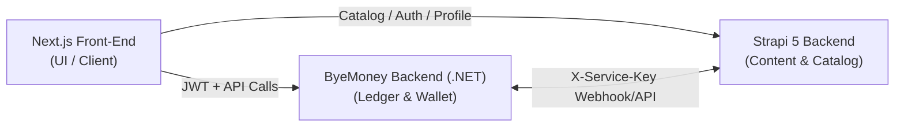

# 💎 CONTEXT_BYEMONEY_INTEGRATION.md
> یادداشت تاریخی فرانت‌اند، سپتامبر ۲۰۲۶. برای قرارداد فعلی API، هویت و قواعد مالی، به [قرارداد اتصال](../../../ByeMoney/docs/integration/ByeMoney-Strapi-Integration.md) و [تصمیم‌های بای‌مانی](../../../ByeMoney/docs/architecture/ByeMoney-Decisions.md) مراجعه کنید. نمونه‌ها و ادعاهای «موجود» در این فایل باید با کد فعلی تطبیق داده شوند.

---

## ۱. مرز مسئولیت سیستم‌ها (System Boundaries & Single Source of Truth)

این پروژه از ادغام سه سیستم مجزا تشکیل شده است:



| سیستم | مسئولیت انحصاری | مواردی که نباید انجام دهد |
|---|---|---|
| **Strapi 5** | کاتالوگ دوره‌ها/محصولات، محتوا، قیمت و تخفیف پایه، مدیریت دسترسی آموزشی (`enrolledCourses`)، هویت اصلی کاربر (`documentId`). | **هرگز** نباید موجودی نور را ذخیره یا محاسبه کند؛ فیلد قدیمی `light` منسوخ است. |
| **ByeMoney (.NET DDD)** | سیستم تبادل ارزش با واحد **«نور»**، کیف پول (`Wallet`)، دفتر کل اتمیک (`Ledger`)، نرخ تبدیل پویا، شارژ کارت‌به‌کارت (`TopUp`)، خرید دوره‌ها، Outbox تحویل. | نباید وارد روابط داخلی دیتابیس استراپی شود و دیتابیس مشترک ندارد. |
| **Next.js Front-End** | لایه رابط کاربری، همگام‌ساز سشن (`byeMoneySync.js`)، کلاینت روت‌ها (`byeMoneyApi.js`)، ذخیره سبد معلق شارژ (`pendingPurchaseManager.js`). | نباید هیچ محاسبه یا قیمت ارسالی از مرورگر را مرجع مالی قرار دهد. فراخوانی مستقیم `fetch` ممنوع است. |

---

## ۲. هویت، توکن و احراز هویت (Auth & Identity)

1. **شناسه اتصال:**
   * هویت خارجی کاربر **منحصراً `documentId` استراپی** است.
   * هرگز از `id` عددی، شماره موبایل یا نام‌کاربری به عنوان شناسه مالی استفاده نشود.
2. **ارتباط کاربر با ByeMoney:**
   * توکن JWT همان سشن استراپی است که در هدر `Authorization: Bearer <jwt>` به اندپوینت‌های بای‌مانی ارسال می‌شود.
3. **همگام‌سازی پس‌زمینه (Background Sync):**
   * کامپوننت `ByeMoneySessionSync` در `src/app/providers.jsx` با لود اولیه یا لاگین، متد `syncByeMoneyUser(jwt)` در `src/lib/byeMoneySync.js` را فراخوانی می‌کند.
   * اندپوینت: `POST /api/auth/sync` با مکانیزم Retry ۴ ثانیه‌ای.
4. **امنیت سرویس به سرویس (Server-to-Server):**
   * ارتباطات بین ByeMoney و Strapi از هدر `X-Service-Key` با حداقل ۳۲ بایت کلید امن در مسیر `/api/integrations/byemoney/v1/` استفاده می‌کنند. کلید سرویس هرگز به فرانت‌اند یا مرورگر داده نمی‌شود.

---

## ۳. منطق مالی، واحدها و نرخ تبدیل (Currencies & Rates)

* **زنجیره تبدیل واحدها:**
  $$\text{تومان (نمایش به کاربر)} \xrightarrow{\times 10} \text{ریال (محاسبه داخلی)} \xrightarrow{\div \text{RialPerNoor}} \text{نور (موجودی کیف پول)}$$
* **نرخ تبدیل (`RialPerNoor`):**
  * نرخ رسمی فقط از تنظیمات (`Settings`) در ByeMoney خوانده می‌شود؛ فرانت نباید نرخ ثابت هاردکد شده را ملاک قطعی تراکنش بداند.
* **دقت اعشاری (Decimal Precision):**
  * در تراکنش‌های نور از دقت اعشاری (تا ۴ رقم اعشار در مدل مالی) پشتیبانی می‌شود؛ نباید مبالغ نور را بی‌دلیل به عدد صحیح گرد یا ترانکیت کرد.
* **خط قرمز واحد منسوخ Light:**
  * در نسخه‌های پیشین استراپی، فیلدی به نام `light` در User وجود داشت. این فیلد کاملاً منسوخ است؛ هرگونه درخواست شارژ یا خواندن از `payment-light` در فرانت یا استراپی اکیداً ممنوع است.

---

## ۴. کلاینت متمرکز فرانت‌اند (`src/lib/byeMoneyApi.js`)

تمام تراکنش‌ها و ارتباطات فرانت‌اند با بای‌مانی **باید صرفاً از طریق توابع این ماژول** انجام شوند:

### ۱. خرید دوره با نور (`purchaseCourseWithByeMoney`)
* **اندپوینت:** `POST /api/courses/purchase`
* **ورودی:** `{ externalCourseId (یا externalCourseIds آرایه), jwt }`
* **رفتار و خروجی:**
  * در صورت موفقیت: `{ success: true, data: { purchaseId, priceInNoor, status, ... } }`
  * در صورت کسری موجودی (کد ۴۰۰ یا خطای Insufficient Balance):
    ```json
    {
      "success": false,
      "insufficientBalance": true,
      "insufficientDetails": {
        "currentBalanceInNoor": 150,
        "priceInNoor": 200,
        "shortfallInNoor": 50,
        "shortfallInRial": 5000000,
        "shortfallInToman": 500000
      },
      "error": "موجودی کیف پول شما کافی نیست."
    }
    ```
  * پشتیبانی از وضعیت ۴۰۹ تعارض (Conflict) در صورت خرید قبلی یا همزمانی.

### ۲. ثبت درخواست شارژ کارت‌به‌کارت (`createTopUpRequestWithByeMoney`)
* **اندپوینت:** `POST /api/topup/requests`
* **ورودی:** `{ amountInNoor, pendingItems, jwt }`
* **رفتار و خروجی:**
  * خروجی شامل `topUpId` و `clientReferenceCode` است که برای پیگیری و ثبت رسید کارت‌به‌کارت استفاده می‌شود.

### ۳. استعلام موجودی واقعی کیف پول (`getWalletBalanceWithByeMoney`)
* **اندپوینت:** `GET /api/wallet/balance`
* **ورودی:** `{ jwt }`
* **خروجی:** `{ success: true, balanceInNoor: 150.5 }`

### ۴. استعلام وضعیت دسترسی/خرید دوره (`checkCoursePurchaseStatusWithByeMoney`)
* **اندپوینت:** `GET /api/courses/:externalCourseId/status`
* **کاربرد:** بازاعتبارسنجی (Revalidation) دسترسی کاربر به دوره بدون وابستگی به کش محلی فرانت‌اند.

### ۵. عملیات ادمین شارژ کارت‌به‌کارت
* **تأیید فیش:** `POST /api/admin/topups/:topUpId/confirm` با `{ confirmedAmount, externalTransactionId, jwt }`
* **رد فیش:** `POST /api/admin/topups/:topUpId/reject` با `{ reason, jwt }`

---

## ۵. جریان سبد خرید معلق (Pending Basket Flow)

هنگامی که کاربر حین فرآیند تسویه حساب (`Checkout`) با کسری موجودی نور مواجه می‌شود:
1. اقلام سبد خرید توسط `pendingPurchaseManager.js` تحت کلید `byemoney_pending_basket` در `localStorage` ذخیره می‌شوند.
2. مودال کارت‌به‌کارت (`CardToCardModal.jsx`) با مبلغ کسری باز می‌شود و درخواست TopUp ثبت می‌گردد.
3. هوک `usePendingPurchaseSync.js` در صفحات مختلف فرانت‌اند وظیفه دارد پس از شارژ و بازگشت کاربر، این سبد را بازیابی کرده و پس از اتمام موفق خرید، آن را پاکسازی (`clearPendingBasket`) کند.

---

## ۶. خطوط قرمز و قوانین اکید توسعه (Strict Invariants)

> [!CAUTION]
> این قوانین برای هرگونه کدنویسی یا پاسخ هوش مصنوعی در رابطه با ByeMoney الزامی و قطعی هستند:

1. **ممنوعیت `fetch` مستقیم در کامپوننت‌ها:** هیچ کامپوننتی حق ندارد مستقیم به آدرس `BYEMONEY_API_URL` ریکوئست بزند؛ فقط از طریق `src/lib/byeMoneyApi.js`.
2. **فقط `documentId`:** هرگز از آی‌دی عددی Strapi (`id`) در تراکنش‌ها، شناسه‌های دوره یا کاربران استفاده نکنید.
3. **عدم ثبت سفارش Pending دوره در استراپی:** در جریان خرید دوره‌ها با نور، قبل از پرداخت در استراپی Order فیک یا معلق نسازید؛ ثبت خرید در بای‌مانی انجام می‌شود و سپس دسترسی دوره به کاربر در استراپی اعطا می‌شود.
4. **عدم تغییر مستقیم موجودی در دیتابیس:** کیف پول تنها یک Projection از Ledger است؛ موجودی تنها با ثبت تراکنش‌های معتبر افزایش یا کاهش می‌یابد.
5. **جداسازی کامل دیتابیس‌ها:** هیچ کوئری مستقیم یا اشتراک دیتابیسی بین دیتابیس استراپی و ByeMoney وجود ندارد. ارتباط فقط از طریق APIهای تعریف‌شده است.

---
